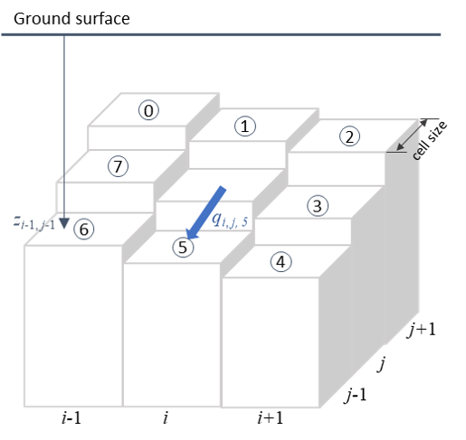

# Soil processes

## 1. Infiltration
### 1.1 Water-input rate less than saturated hydraulic conductivity
If the water inut rate is less than the saturated hydraulic conductivity ($w < K_\upsilon$), the infiltration rate equals the water input rate within the time step:

$$
    f(t) = w
$$

$$
    F(t) = w \cdot t
$$

where: 
- $w$: the water input (rainfall, throughfall, and snowmelt) rate at the surface of soil, [m/h]
- $K_\upsilon$: saturated hydraulic conductivity, [m/h]
- $f(t)$: infiltration rate, [m/h]. Under this condition, $f(t)$ is invariant to time $t$ ([0, time step]).
- $F(t)$: cumulative infiltration, [m]

### 1.2 Water-input rate greater than saturated hydraulic conductivity
An explicit Green-Ampt method proposed by Salvucci and Entekhabi [1994] is applied to estimate the infiltration when the water input rate is larger than saturated hydraulic conductivity ($w > K_\upsilon$). This approach requires computation of three time parameters. 

1). a characteristic time $T^*$, which depends on soil type and the initial water content:

$$
    T^* \equiv \frac{
        |\Psi_f| \cdot (\phi - \theta)
    }{
        K_\upsilon
    }
$$

where:
- $\phi$: soil porosity
- $\theta$: soil water content (moisture)
- $\Psi_f$: effective tension at the wetting front, estimated by using the Brooks-Corey [1964] formula and soil prameters: $|\Psi_f| = \frac{2 \cdot b + 3}{2 \cdot b + 6} |\Psi_{ae}|$
- $b$: parameter that depends on the pore size distribution
- $|\Psi_{ae}|$: air-entry pressure head, [m]

2). a compression time $T_c$:

$$
    T_c \equiv \frac{w \cdot T_p}{K_\upsilon} - 
        \frac{
            |\Psi_f| \cdot (\phi-\theta)
        }{K_\upsilon} \cdot
        \ln[1 + \frac{
            w \cdot T_p
        }{
            |\Psi_f| \cdot (\psi - \theta)
        }]
$$

where $T_p$ is the time of ponding, estimated by 

$$
    T_p = \frac{
        K_\upsilon \cdot |\Psi_f| \cdot (\psi - \theta)
    }{
        w \cdot (w - K_h)
    }
$$

3). An effective time, $t_e$, defined as:

$$
    t_e \equiv t - T_p + T_c, 0 \leq t
$$

The complete explicit solution is an infinite series giving the infiltration rate $f(t_e)$ as a function of the effective time, $t_e$, and the characteristic time $T^*$. However, retaining the first four terms gives sufficient accuracy for most purposes:

$$
    f(t_e) = K_\upsilon \cdot [
        0.707 \cdot (\frac{t_e + T^* }{t_e})^{1/2} + 0.667 - 
        0.236 \cdot (\frac{t_e}{t_e + T^* })^{1/2} - 
        0.138 \cdot (\frac{t_e}{t_e + T^* })
    ]
$$

the cumulative infiltration $F(t_e)$ is then found by integrating:

$$
    F(t_e) = K_\upsilon \cdot [ 
        0.529 \cdot t_e + 
        0.471 \cdot (T^* \cdot t_e + t_e^2) ^{1/2} + 
        0.138 \cdot T^* \cdot [\ln( t_e + T^* ) - \ln( T^* )] + 
        0.471 \cdot T^* \cdot [ 
            \ln[t_e + T^* / 2 + (T^* \cdot t_e + t_e^2)^{1/2}] - 
            \ln(T^* / 2)
        ] 
    ]
$$

## 2. Unsaturaed soil moisture movement
The dynamics of unsaturated moisture movement are simulated
using a two-layer model. The thickness of the upper
zone ($d_1$) is equal to the average rooting depth of the
understory vegetation. The lower zone extends
from $d_1$ to the average overstory rooting depth. The understory
can only extract water from the upper zone, while the
overstory can remove water from both zones. Overstory
transpiration from each soil zone is calculated using(7), then
multiplied by the overstory root fraction in that zone. Soil
evaporation is restricted to the upper zone.

The mass balance for the upper and lower zones is given by

$$
    d_1(\theta_1^{t + \Delta t} - \theta_1^t) = P_0 - P_1(\theta_1) - E_{to} - E_{tu} - E_s + V_{sat} - V_r
$$

$$
    d_2(\theta_2^{t + \Delta t} - \theta_2^t) = P_1(\theta_1) - P_2(\theta_2) - E_{to} + V_{sat}
$$

where:
- $d_1$ and $d_2$: upper and lower soil layer thickness, [m] 
- $\theta_j$: average soil moisture
- $P_0$: the volume of infiltrated rainfall or snowmelt, [m]
- $E_s$: the volume of evaporated soil moisture, [m]
- $V_{sat}$: the volume of water supplied by a rising water table, [m]
- $V_r$: the volume of return flow (generated when a rising water table reaches the ground surface)
- $P_1$ and $P_2$: downward volumes of water discharged from the upper and lower soil zones over the time step, respectively, [m]

### 2.1 Percolation
The discharge volumes $P_1$ and $P_2$ are based on average soil moisture conditions during the time step, $\Delta t$. Discharge is calculated via Darcy's law assuming a unit hydraulic gradient:

$$
    p_j = K_\upsilon(\theta_j)
$$

where:
$K_\upsilon(\theta_j)$ is the soil vertical unsaturated hydraulic conductivity and $j$ equals 1 for the upper layer and 2 for the lower layer.

The Brooks-Corey [Brooks and Corey, 1964]
equation is used to calculate hydraulic conductivity:

$$
    K_\upsilon(\theta_j) = K_\upsilon(\theta_s)
    [\frac{
        \theta - \theta_r
    }{
        \phi - \theta_r
    }]^{2/m+3}
$$

where:
- $m$: the pore size distribution index, the same as aforementioned $b$
- $\phi$: the soil porosity
- $\theta_r$: residual soil moisture content
- $\theta_s$: the saturated moisture content, taken equal to $\phi$

the discharge volume over the time step is given as:

$$
    P_j = [\frac{K_\upsilon(\theta_j^t) + K_\upsilon(\theta_j^*)}{2}] \cdot \Delta t
$$

where: $\theta_j^* = \theta_j^t + P_{j-1}/d_j$.

### 2.2 Desorption
Soil water evaporation from the upper soil layer $E_s$ is given as a function of the potential evaporation demand at the soil surface $E_{ps}$ and the $_e$, the desorption volume. 

The sorptivity (the rate at which the soil loses moisture) is calculated using the method presented by Entekhabi and Eagleson [1989]:

$$
    S_e = [\frac{
        8\phi \cdot K(\theta_s) \cdot \psi_b
    }{
        3(1+3m)(1+4m)
    }]^{1/2} \cdot
    [\frac{\theta}{\phi}]^{1/2m+2}
$$

The desorption volume ($F_e$) is obtained by 

$$
 F_e = S_e \cdot \Delta t^{1/2}
$$

where:
- $\psi_b$: the soil bubbling pressure

## 3. Saturated subsurface flow

Wigmosta et al. [1994] describe an explicit grid cell by grid
cell approach to route saturated subsurface flow. The theory
and computational scheme are developed for point elevation
data on an orthogonal grid. Grid cells are centered
at each elevation point (e.g., solid square surrounding the
elevation point $i, j$ in Figure 1). Each grid cell can exchange
water with its eight adjacent neighbors. Directions between a
node and its neighbors are assigned the index $k$ and numbered
from 0 to 7 in a clockwise direction beginning with the upper
left-hand node. For example, $k - 2$ corresponds to the direction
between elevation point $i, j$ and point $i + 1, j - 1$. Local
hydraulic gradients are approximated by local water table
slopes. On steep slopes with thin, permeable soils, hydraulic
gradients may be approximated by local ground surface slopes.

### 3.1 Saturated flow routing

The rate of saturated subsurface flow at time $t$ from cell $i, j$
to its down-gradient neighbors may be calculated under Dupuit-
Forchheimer assumptions [Freeze and Cherry, 1979] as

$$
    q_{i,j,k} = - T_{i,j,k} \cdot \tan \beta_{i,j,k} \cdot w_{i,j,k}, 
    \beta_{i,j,k} < 0
$$

$$
    q_{i,j,k} = 0, \beta_{i,j,k} \geqslant 0
$$

where:
- $q_{i,j,k}$: the flow rate from cell $i,j$ in the $k$ flow direction 
- $T_{i,j,k}$: the transmissivity at cell $i,j$ corresponding to the $k$ direction
- $\beta_{i,j,k}$: the water table slope in the $k$ direction
- $w_{i,j,k}$: the width of flow

The power law transmissivity function may be specified as:

$$
    T_{i,j,k} = \frac{
        K_{oi,j,k} \cdot D_{i,j}
    }{
        n_{i,j}
    } \cdot
    (
        1 - \frac{z_{i,j}}{D_{i,j}}
    )^{n_{i,j}}
$$

where:
- $K_{oi,j,k}$: the saturated hydraulic conductivity at the soil surface in cell $i,j$ in the $k$ idrection
- $D_{i,j}$: the soil thickness at cell $i,j$
- $n_{i,j}$: the local power law exponent $n = 2 \cdot b + 3$, $b$ is the pore-size distribution parameter in Brooks and Corey (1964) formula

By substituting, yields:

$$
    q_{i,j,k} = \gamma_{i,j,k} \cdot h_{i,j}
$$

where (for $\beta_{i,j,k} < 0$):

$$
    \gamma_{i,j,k} = - \frac{
        w_{i,j,k}K_{oi,j,k}D_{i,j}
    }{
        n_{i,j}
    } \cdot \tan \beta_{i,j,k}
$$

$$
    h_{i,j} = (1 - \frac{z_{i,j}}{D_{i,j}})^{n_{i,j}}
$$

The total saturated subsurface outflow from cell $i,j$ ($Q_{out_{i,j}}$) is calculated as:

$$
    Q_{out_{i,j}} = h_{i,j} \cdot \sum_{k=0}^7 \gamma_{i,j,k}
$$

For model application, it is more efficient to reformulate $q_{i,j,k}(t)$ as:

$$
    q_{i,j,k}(t) = F_{i,j,k}Q_{out_{i,j}}
$$

where:

$$
    F_{i,j,k} = \gamma_{i,j,k} / \sum_{k=0}^{7} \gamma_{i,j,k} 
$$

The total inflow to cell $i,j$ from up-gradient cells ($Q_{in_{i,j}}$) is given by:

$$
    Q_{in_{i,j}} = \sum_{k=0}^7 F_{k} \cdot Q_{out_{k}}
$$

where in this case $k$ represents the source grid cell location. 

The change in $z_{i,j}$ over the time step is given by

$$
    \Delta z_{i,j} = \frac{1}{\phi_{i,j}} \cdot
    [
        \frac{
            Q_{out_{i,j}} - Q_{in_{i,j}} 
        }{
            A_{i,j}
        } - R_{i,j}
    ] \cdot \Delta t
$$

where:
- $\phi_{i,j}$: the local effective porosity
- $A_{i,j}$: the grid cell area (horizontal projection)
- $R_{i,j}$: percolation from unsaturated soil zone

*Note: Effective porosity is that portion of the total void space of a porous material that is capable of transmitting a fluid. Total porosity is the ratio of the total void volume to the total bulk volume.*

Negative values of $z_{i,j}$ represent "exfiltration" of subsurface water to the surface, available for overland flow routing.

### 3.2 Flow Interception by Stream Channels

A grid cell will contribute water to a stream reach when
the grid cell water table rises above the streambed. Subsurface flow will be intercepted by the channel at a
rate given by:

$$
    Q_{C_{i,j}} = 2L_{C_{i,j}} \beta_{C_{i,j}} T_{i,j}(z,z_C)
$$

where:
- $z_C$: the depth to the channel bed, [m] 
- $L_{C_{i,j}}$: the length of the channel crossing the grid cell
- $T_{i,j}(z,z_C)$: the transmissivity of the saturated zone above the streambed. The hydraulic gradient is approximated by:

$$
    \beta_{C_{i,j}} = \frac{
        z_{C_{i,j}} - z_{i,j}
    }{
        0.5w_{C_{i,j}}
    }
$$

where:
- $w_{C_{i,j}}$: the width of the stream reach, [m]

if surface water is available within the cell, it is contributed to the stream reach in the same time interval.

## 4. Some soil parameters

Brooks-Corey parameters for various soil texture based on analysis of 1845 soils [Clapp and Hornberger, 1978]

| Soil texture | $\phi$ | $K_\upsilon$ (cm/s) | $\|\Psi_{ae} \|$ (cm) | $b$ |
| :----------- | :----: | :------------: | :-------------: | :---: |
|Sand|0.395 (0.056)|1.76×10–2|12.1 (14.3)|4.05 (1.78) |
|Loamy sand|0.410 (0.068)|1.56×10–2|9.0 (12.4)|4.38 (1.47) |
|Sandy loam|0.435 (0.086)|3.47×10–3|21.8 (31.0)|4.90 (1.75) |
|Silt loam|0.485 (0.059)|7.20×10–4|78.6 (51.2)|5.30 (1.96) |
|Loam|0.451 (0.078)|6.95×10–4|47.8 (51.2)|5.39 (1.87) |
|Sandy clay loam|0.420 (0.059)|6.30×10–4|29.9 (37.8)|7.12 (2.43)|
|Silty clay loam|0.477 (0.057)|1.70×10–4|35.6 (37.8)|7.75 (2.77)|
|Clay loam|0.476 (0.053)|2.45×10–4|63.0 (51.0)|8.52 (3.44)|
|Sandy clay|0.426 (0.057)|2.17×10–4|15.3 (17.3)|10.4 (1.64)|
|Silty clay|0.492 (0.064)|1.03×10–4|49.0 (62.1)|10.4 (4.45)|
|Clay|0.482 (0.050)|1.28×10–4|40.5 (39.7)|11.4 (3.70)|

values in parentheses are standard deviations. 

## References:

Brooks, R. H., and A. T. Corey, Hydraulic properties of porous
media, Hydrol. Pap., 3, Colorado State University, Fort Collins, 1964.

Clapp, R. B., and G. M. Hornberger (1978).
Empirical equations for some soil
hydraulic properties. Water Resources
Research 14:601–604.

Entekhabi, D., and P.S. Eagleson, Land surface hydrology parameterization for atmospheric general circulation models: Inclusion of subgrid scale spatial variability and screening with a simple climate model, Rep. 325, Ralph M. Parsons Lab., 195 pp., Mass. Inst. of Technol., Cambridge, 1989.

Freeze, R. A., and J. A. Cherry, Groundwater, Prentice-Hall, Englewood
Cliffs, N.J., 1979.

Salvucci, G.D. and Entekhabi, D.  1994.  Explicit expressions for Green-Ampt (delta function diffusivity) infiltration rate and cumulative storage. Water Resources Research, 30(9), 2661-2663. doi: https://doi.org/10.1029/94WR01494.

Wigmosta, M. S., L. W. Vail, and D. P. Lettenmaier, A distributed
hydrology-vegetatiomn odel for complext errain, Water Resour. Res.,
30(6), 1665-1679, 1994.

